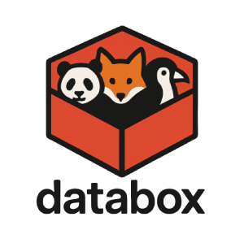

# Databox [](https://github.com/knom/databox/actions/workflows/dotnet.yml) [](https://github.com/knom/databox/actions/workflows/e2e-tests.yml)

> One-time verified file and message submission system with email delivery.



*Logo created with ChatGPT*

## 🚀 Overview

Databox is a lightweight ASP.NET Core MVC application that allows verified website users to securely upload and submit files into a databox that can be accessed by the operators.

## 🤖 AI Tools used
- ChatGPT for texts, logo and initial source code scaffolding
- Github Copilot for tuning the source code in VSCode
- Openhands/AllHands.dev for E2E tests scaffolding
- GenTube for graphics

## ✨ Features

- One-time email verification flow
- Drag & drop multi-file upload
- Email delivery with HTML templating (Handlebars.NET)
- Temporary SQLite storage
- Automatic cleanup of unverified submissions (Quartz.NET)
- Dockerized release build

For more details see the [User Stories](USERSTORIES.md).

## 📦 Running in Docker

```bash
docker build -t databox .
docker run -p 8080:8080 -v $(pwd)/data:/app/data databox
```

### 📁 Volume Mapping
Here's a list of important files / paths that should be mapped for persistence.

| Container Path          | Purpose                 |
| ----------------------- | ----------------------- |
| `/app/appsettings.json` | App configuration file  |
| `/app/data/`            | SQLite database storage |
| `/app/uploads/`         | Temporary user-uploaded files |
| `/app/keys/`            | Anti-Forgery Token keys |
| `/app/logs/`            | Log file output         |
| `/app/templates/`       | Email templates         |


## 🔧 Configuration

All settings can be configured via `appsettings.json` or environment variables:

```json
{
  "Logging": {
    "FileEnabled": true,
    "LogLevel": {
      "Default": "Warning",
      "Databox": "Information"
    }
  },
  "AllowedHosts": "*",
  "App": {
    "BasePath": "/databox",
    "BaseUrl": "https://yoursite.com/databox/"
  },
  "Databox": {
    "SubmissionMail": {
      "SendTo": "databox@yoursite.com",
      "Subject": "[Databox] New documents Received",
      "Template": "templates/new-submission-email.template"
    },
    "VerificationMail": {
      "Subject": "[Databox] Your Databox submission",
      "Template": "templates/verification-email.template"
    },
    "TempFileStoragePath" : "/tmp/databox-uploads/"
  },
  "Email": {
    "From": "sender@yoursite.com",
    "SmtpServer": "smtp.server.com",
    "SmtpPort": "587",
    "Username": "sender@yoursite.com",
    "Password": "...",
    "Ssl": "true"
  },
  "ConnectionStrings": {
    "DatabaseProvider": "sqlite",
    "Default": "Data Source=data/databox.db"
  }
}
```

| Key                                  | Description                                                      |
| ------------------------------------ | ---------------------------------------------------------------- |
| `App.BasePath`                       | The base URL path where Databox is hosted (e.g. `/databox`). Can be skipped if it is just `/`. This is usefull for running behind NGINX, Traeffik or other reverse proxies with subpath. |
| `App.BaseUrl`                        | The full public-facing base URL, used in links inside emails.    |
| `Databox.SubmissionMail.SendTo`      | Email address to receive user submissions.                       |
| `Databox.SubmissionMail.Subject`     | Subject line for the submission email.                           |
| `Databox.SubmissionMail.Template`    | Path to the Handlebars email template for submissions.           |
| `Databox.VerificationMail.Subject`   | Subject line for verification email sent to the user.            |
| `Databox.VerificationMail.Template`  | Path to the Handlebars email template for verification.          |
| `Databox.TempFileStoragePath`        | Path to where the files will be uploaded temporarily.
| `Email.From`                         | From address used in outgoing emails.                            |
| `Email.SmtpServer`                   | SMTP server hostname.                                            |
| `Email.SmtpPort`                     | SMTP server port (usually 587 for TLS).                          |
| `Email.Username`                     | SMTP login username.                                             |
| `Email.Password`                     | SMTP login password.                                             |
| `Email.Ssl`                          | `"true"` to enable SSL/TLS on SMTP.                              |
| `ConnectionStrings.DatabaseProvider` | Right now only `"sqlite"`, `"sqlserver"` and `"postgresql"` is supported as  provider.                       |
| `ConnectionStrings.Default`          | Database connection string (e.g., `Data Source=data/databox.db`). |
| `Logging.LogLevel`                   | Controls logging verbosity (for Databox and the rest).                                      |
| `Logging.FileEnabled`                   | Controls whether file log to log/log-xx.txt is written.       |


## 🐳 Override Config via Docker
All config settings can also be specified as environment variables.
```
docker run -p 8080:8080 \
  -v $(pwd)/data:/app/data \
  -e "App__BaseUrl=https://yourdomain.com/databox/" \
  -e "Email__Password=your-smtp-password" \
  -e "ConnectionStrings:Default=Data Source=data/override.db" \
  databox
```
🔐 Note: Double underscores (__) can be used instead of colons (:) in nested keys.

## Development

The project is developed in .NET 8.0 using ASP.NET MVC Core & Rest APIs.
It's available under [MIT License](LICENSE)

### 🧪 Testing

The project includes comprehensive end-to-end tests using Playwright:

```bash
cd tests/e2e
npm install
npx playwright install
npm test
```

See [E2E Test Documentation](tests/e2e/README.md) for detailed testing information.

### 📁 Project Structure

```
Databox/
├── Controllers/    # ASP.NET MVC Core Controllers
├── Models/         # Data Models
├── Views/          # Razor Views
├── Services/       # Helper Services
├── Jobs/           # Quartz Scheduler Jobs
├── Data/           # Entitiy Framework Context
├── Program.cs      # Startup file
├── wwwroot/        # Public webserver assets (CSS, images, ...)
├── appsettings.json
└── Dockerfile
```

### 🧪 Compiling

Make sure [.NET 8.0 SDK](https://dotnet.microsoft.com/en-us/download/dotnet/8.0) is installed.

```bash
dotnet restore
dotnet run
```

Visit: http\://localhost:xxxx

---

MIT Licensed. Made with ❤️ with a lot of AI
